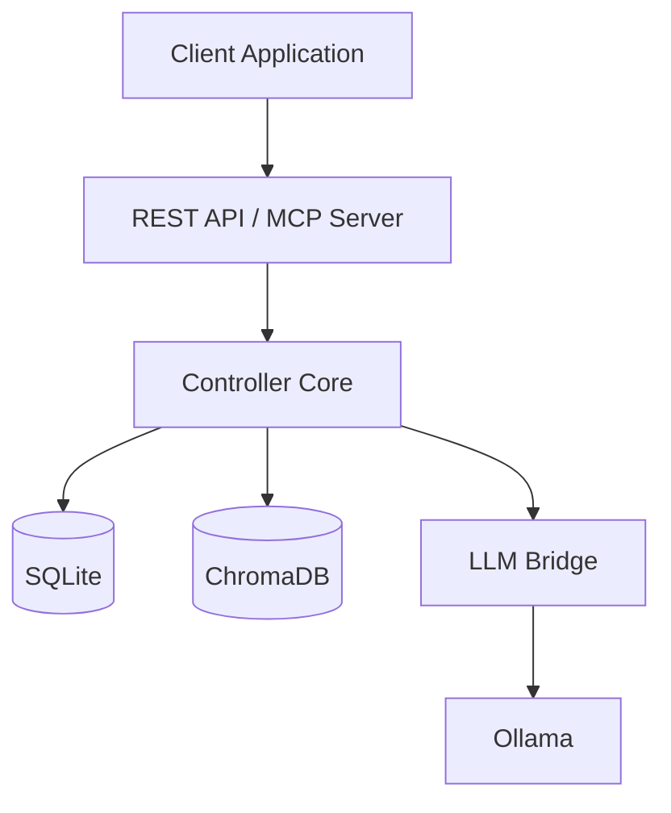
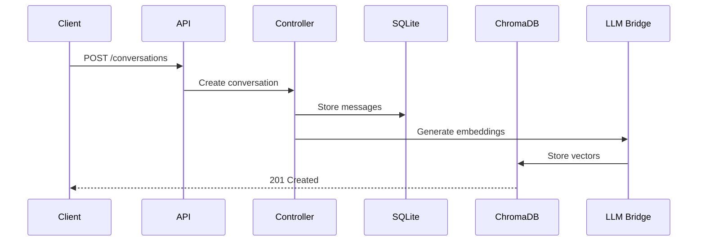

# Architecture

Understand how Sekha works under the hood.

## System Components

Sekha consists of three main components:

### 1. Controller (Rust)

The core memory engine handling all operations:

- REST API server (Axum)
- Database layer (SeaORM + SQLite)
- Memory orchestration logic
- Context assembly algorithms
- MCP protocol server

[Learn more →](overview.md#controller)

### 2. LLM Bridge (Python)

Handles all LLM-related operations:

- Embedding generation (Ollama/OpenAI/Anthropic)
- Conversation summarization
- Label suggestions
- Async queue processing

[Learn more →](overview.md#llm-bridge)

### 3. Storage Layer

Dual storage approach:

- **SQLite** - Structured data (conversations, metadata)
- **ChromaDB** - Vector embeddings for semantic search

[Learn more →](overview.md#storage)

## Key Concepts

### Memory Orchestration

How Sekha intelligently manages and retrieves memories:

[**Memory Orchestration →**](memory-orchestration.md)

- Semantic search with embeddings
- Context budgeting and prioritization
- Importance scoring
- Folder-based organization

### Data Flow

End-to-end flow of data through the system:

1. **Store** → Messages saved to SQLite
2. **Embed** → LLM Bridge generates embeddings
3. **Index** → ChromaDB stores vectors
4. **Query** → Semantic search retrieves relevant context
5. **Assemble** → Optimal context built for LLM

## Architecture Diagrams

### High-Level Overview

### Request Flow

## Next Steps

- [System Overview](overview.md) - Detailed component architecture
- [Memory Orchestration](memory-orchestration.md) - How memory management works
- [Deployment](../deployment/docker-compose.md) - Deploy the stack
