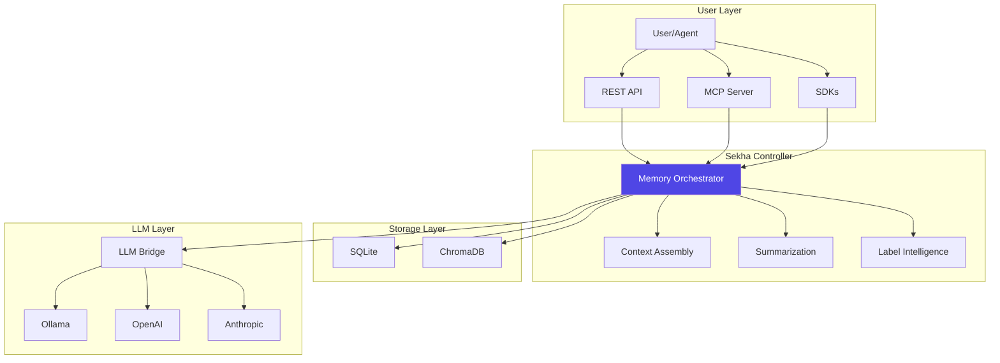
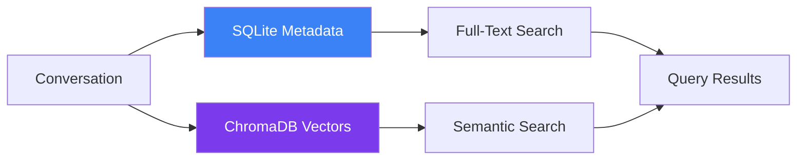

# Architecture

Understand how Sekha AI Memory Controller works under the hood.

## Overview

Sekha is a **memory orchestration system** that sits between users/agents and LLMs, providing persistent, searchable, and infinite context.

## Core Components

### [Controller (Rust)](controller.md)
The heart of Sekha - handles all memory operations, orchestration, and API serving.

### [LLM Bridge (Python)](llm-bridge.md)
Provides LLM operations: embeddings, summarization, and tool calling.

### [Memory Orchestration](memory-orchestration.md)
Intelligent context assembly, hierarchical summarization, and deduplication.

### [Data Flow](data-flow.md)
How data moves through the system from storage to retrieval.

### [MCP Protocol](mcp-protocol.md)
Model Context Protocol integration for Claude Desktop and compatible tools.

## Architecture Principles

### Local-First
All data stays on your infrastructure by default. No external dependencies.

### LLM-Agnostic
Plug any LLM provider - Ollama, OpenAI, Anthropic, or custom models.

### Production-Ready
- 85%+ test coverage
- Sub-100ms query performance
- Horizontal scalability
- Battle-tested in production

### Portable
Single binary deployment. Runs anywhere Rust compiles.

## Storage Architecture

### SQLite
- Conversation metadata
- Labels, folders, status
- Importance scores
- Relationships

### ChromaDB
- 768-dimension embeddings
- Semantic similarity search
- Millions of vectors
- Sub-100ms queries

## Deployment Options

- **[Local Binary](../deployment/local-binary.md)** - Single executable
- **[Docker Compose](../deployment/docker-compose.md)** - Full stack
- **[Kubernetes](../deployment/kubernetes.md)** - Production scale
- **[Cloud](../deployment/aws.md)** - AWS, Azure, GCP

## Learn More

Explore detailed architecture documentation:

- [System Overview](overview.md)
- [Controller Deep Dive](controller.md)
- [LLM Bridge](llm-bridge.md)
- [Memory Orchestration](memory-orchestration.md)
- [Data Flow](data-flow.md)
- [MCP Protocol](mcp-protocol.md)