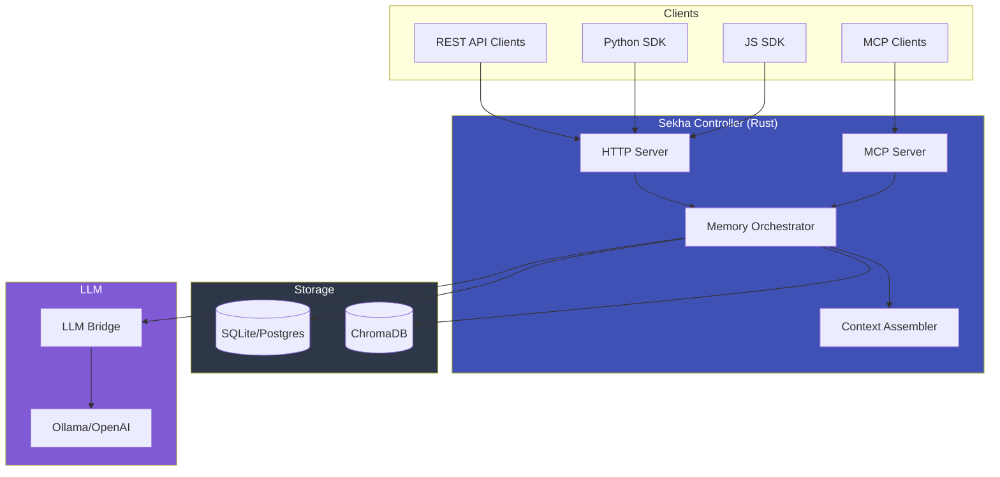
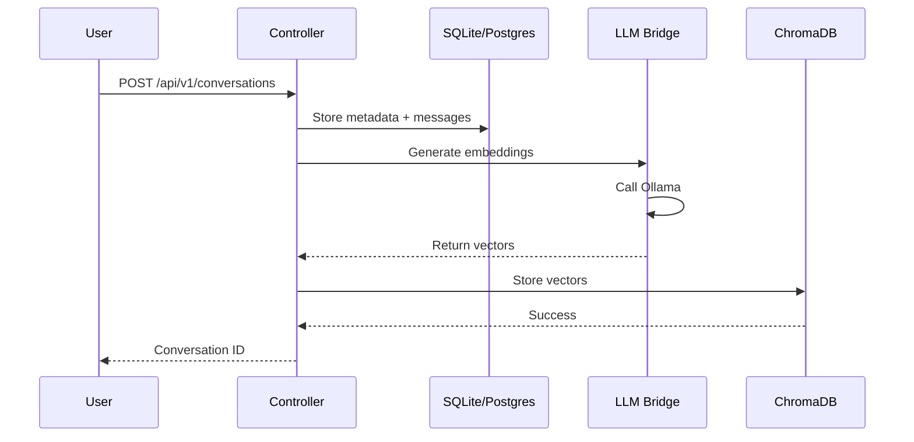
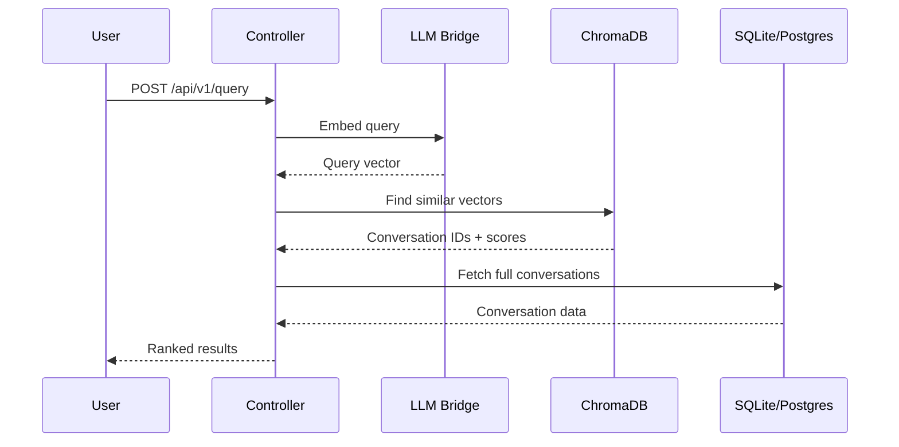
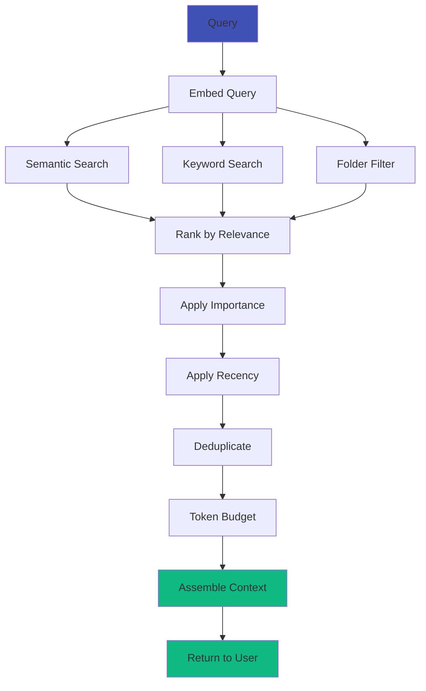
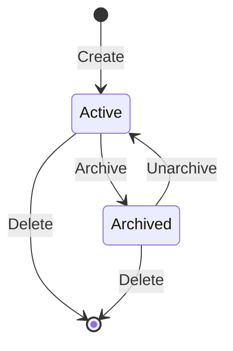

# Architecture Overview

Sekha is designed as a production-grade distributed system for persistent AI memory.

## High-Level Architecture



---

## Core Components

### 1. Sekha Controller (Rust)

**The memory engine and orchestrator.**

**Key responsibilities:**

- REST API server (17 endpoints)
- MCP protocol server (7 tools)
- Memory orchestration and retrieval
- Context assembly algorithms
- Request routing and validation

**Technology:**

- Language: Rust 1.83+
- Web framework: Axum
- ORM: SeaORM
- Binary size: ~50MB
- Performance: Sub-100ms queries

[:octicons-arrow-right-24: Controller Details](core-components.md#controller)

---

### 2. LLM Bridge (Python)

**Handles all LLM operations.**

**Key responsibilities:**

- Generate embeddings (768-dim vectors)
- Create hierarchical summaries
- Label suggestions
- Provider abstraction (Ollama, OpenAI, etc.)

**Technology:**

- Language: Python 3.11+
- Framework: FastAPI
- LLM integration: LangChain
- Current provider: Ollama

[:octicons-arrow-right-24: Bridge Details](core-components.md#llm-bridge)

---

### 3. Storage Layer

**Dual storage for structured + semantic data.**

#### SQLite/PostgreSQL

**Stores:**

- Conversation metadata (labels, folders, importance)
- Message content and timestamps
- Relationships and organization
- User preferences

**Why:**

- ACID guarantees
- Complex queries (JOINs, aggregations)
- Mature ecosystem

#### ChromaDB

**Stores:**

- 768-dimension embedding vectors
- Semantic similarity indices
- Fast cosine similarity search

**Why:**

- Sub-100ms semantic search
- Scales to millions of vectors
- Efficient batching

[:octicons-arrow-right-24: Storage Details](core-components.md#storage)

---

### 4. MCP Server

**Model Context Protocol integration.**

**Enables:**

- Claude Desktop integration
- VS Code extension (Cline)
- Cursor AI integration
- Any MCP-compatible client

**Tools:**

- `memory_store` - Save conversations
- `memory_query` - Semantic search
- `memory_get_context` - Retrieve context
- `memory_export` - Export to JSON/Markdown
- And 3 more...

[:octicons-arrow-right-24: MCP Integration](../integrations/claude-desktop.md)

---

## Data Flow

### Storing a Conversation



**Steps:**

1. User sends conversation via REST API
2. Controller validates and stores in SQLite/Postgres
3. Controller requests embeddings from Bridge
4. Bridge calls Ollama to generate 768-dim vectors
5. Controller stores vectors in ChromaDB
6. Returns conversation ID to user

---

### Semantic Search



**Steps:**

1. User submits natural language query
2. Controller gets query embedding from Bridge
3. ChromaDB performs cosine similarity search
4. Returns top-k conversation IDs with scores
5. Controller fetches full conversation data from DB
6. Returns ranked results to user

---

### Context Assembly

**The most complex operation - building optimal context for LLMs.**



**Algorithm:**

1. **Embed query** - Convert natural language to vector
2. **Multi-source retrieval**:
   - Semantic search (ChromaDB)
   - Keyword search (SQLite FTS5)
   - Folder filtering (if specified)
3. **Scoring**:
   - Semantic similarity (0.0-1.0)
   - Importance score (1-10)
   - Recency (exponential decay)
   - Combined: `score = 0.5*semantic + 0.3*importance + 0.2*recency`
4. **Deduplication** - Remove redundant information
5. **Token budget** - Fit within context window (default 8k tokens)
6. **Assembly** - Build hierarchical context

[:octicons-arrow-right-24: Orchestration Details](memory-orchestration.md)

---

## Memory Organization

### Hierarchical Structure

```
Folders (filesystem-like)
├── /work
│   ├── /projects
│   │   ├── /sekha              (label: Architecture Planning)
│   │   └── /client-app         (label: Bug Fixes)
│   └── /meetings
├── /personal
│   ├── /learning
│   │   ├── /rust               (label: Async Programming)
│   │   └── /ai                 (label: RAG Systems)
│   └── /cooking
└── /research
    └── /papers
```

### Importance Scoring

| Score | Meaning | Use Case |
|-------|---------|----------|
| 1-3 | Low | Casual chats, temp notes |
| 4-6 | Normal | Most conversations |
| 7-9 | High | Important decisions, learnings |
| 10 | Pinned | Never prune, always include |

### Status Lifecycle



---

## Performance Characteristics

### Latency

| Operation | Typical | P95 | P99 |
|-----------|---------|-----|-----|
| Store conversation | 50ms | 150ms | 300ms |
| Semantic search | 30ms | 80ms | 150ms |
| Context assembly | 100ms | 250ms | 500ms |
| Embedding (1 msg) | 200ms | 500ms | 1s |

### Scale

| Metric | SQLite | PostgreSQL |
|--------|--------|------------|
| Max conversations | 1M+ | 100M+ |
| Max messages | 10M+ | 1B+ |
| Concurrent users | 1 | 1000+ |
| Query throughput | 100 qps | 10k+ qps |

---

## Security Model

### Authentication

- Bearer token authentication (API key)
- Minimum 32 characters
- Configurable via `config.toml` or env vars

### Authorization

- Single-user model (v1.0)
- Multi-tenant coming in Q2 2026
- RBAC planned for enterprise

### Data Privacy

- Local-first architecture
- No telemetry by default
- Air-gapped deployment supported
- GDPR/HIPAA-ready (self-hosted)

---

## Deployment Topology

### Single-Node (Development)

```
┌───────────────────────┐
│   Docker Compose        │
│                         │
│  ┌─────────────────┐ │
│  │ Controller      │ │
│  │ Bridge          │ │
│  │ ChromaDB        │ │
│  │ Ollama          │ │
│  └─────────────────┘ │
└───────────────────────┘
```

### Multi-Node (Production)

```
┌───────────────────────────┐
│  Load Balancer           │
└────────┬──────────────────┘
         │
    ┌────┼────┐
    │         │
    ▼         ▼
┌───────────────────┐
│ Controller 1      │
│ Controller 2      │
│ Controller N      │
└────────┬──────────┘
         │
    ┌────┼────────┐
    ▼         ▼        ▼
┌──────────────────────────────┐
│ PostgreSQL (Primary + Replicas) │
│ ChromaDB Cluster               │
│ Redis Cache                    │
└──────────────────────────────┘
```

---

## Next Steps

- [Core Components](core-components.md) - Deep dive into each component
- [Memory Orchestration](memory-orchestration.md) - How context assembly works
- [Data Flow](data-flow.md) - Request lifecycle details
- [Deployment Guide](../deployment/docker-compose.md) - Deploy to production

---

!!! quote "Design Principles"

    1. **Simplicity** - Easy to deploy, hard to misconfigure
    2. **Performance** - Sub-100ms queries at scale
    3. **Reliability** - ACID guarantees, crash recovery
    4. **Privacy** - Local-first, no external dependencies
    5. **Extensibility** - Plugin architecture for LLMs, storage

[:octicons-arrow-right-24: Learn More](core-components.md){ .md-button .md-button--primary }