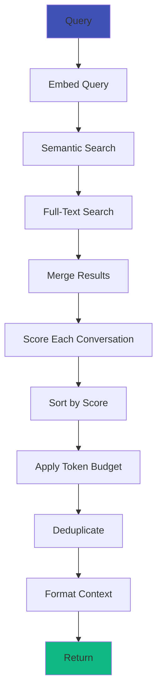

# Memory Orchestration

## Overview

Memory orchestration is the **core intelligence** of Sekha. It determines which conversations are relevant for a given query and assembles them into optimal context for LLMs.

**Goals:**

- Maximize relevance (semantic + keyword matching)
- Respect token budgets (fit within LLM context window)
- Balance recency vs. importance
- Minimize redundancy
- Sub-100ms latency

---

## Context Assembly Algorithm

### Input

```rust
pub struct ContextRequest {
    query: String,              // User's next prompt
    context_budget: usize,      // Max tokens (default: 4000)
    preferred_labels: Vec<String>,  // Priority labels
    recency_weight: f32,        // 0.0-1.0 (default: 0.3)
    relevance_weight: f32,      // 0.0-1.0 (default: 0.5)
    importance_weight: f32,     // 0.0-1.0 (default: 0.2)
}
```

### Output

```rust
pub struct ContextResponse {
    context: Vec<Conversation>,
    total_tokens: usize,
    conversations_included: usize,
    budget_used: f32,  // Percentage
}
```

### Algorithm Steps



---

## Step 1: Query Embedding

**Convert natural language to vector representation.**

```rust
let query_vector = llm_bridge
    .embed(query)
    .await?;
// Returns: [0.123, -0.456, ..., 0.789] (768 dimensions)
```

**Models used:**
- `all-MiniLM-L6-v2` (384-dim, fast)
- `all-mpnet-base-v2` (768-dim, accurate)

**Latency:** ~50ms for short queries

---

## Step 2: Multi-Source Retrieval

### Semantic Search (ChromaDB)

**Find conversations with similar meaning.**

```rust
let semantic_results = chroma
    .query(
        collection: "conversations",
        query_embeddings: vec![query_vector],
        n_results: 20,
    )
    .await?;
```

**Scoring:** Cosine similarity (0.0-1.0)

```
similarity = (A · B) / (||A|| × ||B||)
```

**Example:**

- Query: "How do I deploy Sekha to production?"
- Top match: "Deployment guide for Kubernetes" (score: 0.87)
- Also matches: "Docker compose setup" (score: 0.72)

### Full-Text Search (SQLite FTS5)

**Find exact keyword matches.**

```sql
SELECT conversation_id, rank
FROM conversations_fts
WHERE conversations_fts MATCH ?
ORDER BY rank
LIMIT 20;
```

**Ranking:** BM25 algorithm

**Example:**

- Query: "OAuth 2.0 implementation"
- Exact match: "OAuth 2.0 design decisions" (rank: 1)
- Partial: "API authentication" (rank: 0.3)

### Folder Filtering

**If user specifies folder:**

```rust
let filtered = results
    .filter(|c| c.folder.starts_with("/work/backend"))
    .collect();
```

---

## Step 3: Scoring

**Combine multiple signals into a single relevance score.**

### Scoring Formula

```
final_score = 
    (relevance_weight × semantic_score) +
    (importance_weight × importance_score) +
    (recency_weight × recency_score)
```

**Default weights:**
- Relevance: 0.5 (50%)
- Importance: 0.2 (20%)
- Recency: 0.3 (30%)

### Component Scores

**1. Semantic Score (0.0-1.0)**

Direct from ChromaDB cosine similarity.

```rust
semantic_score = cosine_similarity(query_vector, conversation_vector)
```

**2. Importance Score (0.0-1.0)**

Normalize user-assigned importance (1-10):

```rust
importance_score = conversation.importance / 10.0
```

**3. Recency Score (0.0-1.0)**

Exponential decay based on age:

```rust
recency_score = exp(-age_days / 30.0)
```

**Decay curve:**

| Age | Score |
|-----|-------|
| Today | 1.0 |
| 7 days | 0.79 |
| 30 days | 0.37 |
| 90 days | 0.05 |
| 180 days | 0.002 |

### Example Calculation

```rust
// Conversation A: Recent (3 days), Medium Importance (5), High Relevance (0.9)
let score_a = 
    0.5 * 0.9 +     // Relevance
    0.2 * 0.5 +     // Importance
    0.3 * 0.88;     // Recency
// = 0.45 + 0.10 + 0.26 = 0.81

// Conversation B: Old (90 days), High Importance (9), Medium Relevance (0.6)
let score_b =
    0.5 * 0.6 +
    0.2 * 0.9 +
    0.3 * 0.05;
// = 0.30 + 0.18 + 0.015 = 0.495

// A wins (0.81 > 0.495) despite B being more important
```

---

## Step 4: Token Budget Management

**Fit conversations within LLM's context window.**

### Token Counting

```rust
fn count_tokens(text: &str, model: &str) -> usize {
    match model {
        "gpt-4" => text.len() / 4,        // ~4 chars per token
        "llama" => text.split_whitespace().count(),  // ~1 word per token
        _ => text.len() / 4,
    }
}
```

### Greedy Packing Algorithm

```rust
let mut included = Vec::new();
let mut tokens_used = 0;

for conversation in sorted_by_score {
    let tokens = count_tokens(&conversation.content);
    
    if tokens_used + tokens <= context_budget {
        included.push(conversation);
        tokens_used += tokens;
    } else {
        break;  // Budget exhausted
    }
}
```

### Truncation Strategies

**If conversation exceeds budget:**

1. **Include summary only** (10% of original tokens)
2. **Include first/last N messages** (preserve beginning + end)
3. **Include message snippets** (relevant excerpts)

**Example:**

```rust
if conversation.tokens > (budget * 0.3) {
    // Too large, use summary
    return conversation.summary;
} else {
    return conversation.full_content;
}
```

---

## Step 5: Deduplication

**Remove redundant information.**

### Similarity-Based Deduplication

```rust
for i in 0..included.len() {
    for j in (i+1)..included.len() {
        let similarity = cosine_similarity(
            included[i].embedding,
            included[j].embedding,
        );
        
        if similarity > 0.95 {
            // Nearly identical, keep higher-scored one
            if included[i].score > included[j].score {
                included.remove(j);
            } else {
                included.remove(i);
            }
        }
    }
}
```

### Content Overlap Detection

**Check for repeated messages:**

```rust
let mut seen_messages = HashSet::new();

for conversation in included {
    conversation.messages.retain(|msg| {
        seen_messages.insert(hash(msg.content))
    });
}
```

---

## Step 6: Context Formatting

**Assemble final context for the LLM.**

### Hierarchical Format

```markdown
# Relevant Context

## Conversation: API Design Discussion
**Folder:** /work/backend
**Date:** 2026-01-20
**Importance:** 8/10

### Messages

**User:** How should we structure the REST API?

**Assistant:** I recommend RESTful design with these endpoints:
- POST /api/v1/conversations - Store conversation
- GET /api/v1/conversations/{id} - Retrieve
...

---

## Conversation: OAuth Implementation
**Folder:** /work/auth
**Date:** 2026-01-15
**Importance:** 9/10

### Messages

**User:** We need to add OAuth 2.0

**Assistant:** Here's the implementation plan...
```

### JSON Format (for APIs)

```json
{
  "context": [
    {
      "conversation_id": "uuid-1",
      "label": "API Design Discussion",
      "score": 0.87,
      "messages": [
        {"role": "user", "content": "..."},
        {"role": "assistant", "content": "..."}
      ]
    },
    ...
  ],
  "metadata": {
    "total_tokens": 3245,
    "conversations_included": 4,
    "budget_used": 0.81
  }
}
```

---

## Advanced Features

### Pinned Conversations

**Always include, regardless of score:**

```rust
let pinned = conversations
    .filter(|c| c.importance == 10)
    .collect();

let mut context = pinned;
let budget_remaining = context_budget - count_tokens(&pinned);

// Fill remaining budget with scored conversations
```

### Preferred Labels

**Boost conversations with specific labels:**

```rust
if preferred_labels.contains(&conversation.label) {
    score *= 1.5;  // 50% boost
}
```

### Temporal Awareness

**Respect conversation chronology:**

```rust
// Sort by timestamp within same project
context.sort_by(|a, b| a.created_at.cmp(&b.created_at));
```

### Summarization Cascade

**Use hierarchical summaries for very old conversations:**

```
Conversation (today)     → Full content (1000 tokens)
Conversation (1 week)    → Daily summary (100 tokens)
Conversation (1 month)   → Weekly summary (50 tokens)
Conversation (3 months)  → Monthly summary (20 tokens)
Conversation (1 year)    → Yearly summary (10 tokens)
```

---

## Performance Optimizations

### Caching

```rust
pub struct ContextCache {
    cache: LruCache<String, ContextResponse>,
    ttl: Duration,
}

if let Some(cached) = cache.get(query_hash) {
    return cached;  // Sub-millisecond response
}
```

**Invalidation:**
- TTL: 5 minutes
- On new conversation stored
- On conversation updated

### Parallel Processing

```rust
let (semantic_results, fts_results) = tokio::join!(
    chroma.query(query_vector),
    sqlite.fts_search(query),
);
```

### Batch Embedding

```rust
// Instead of N round-trips
for conversation in conversations {
    let embedding = llm_bridge.embed(conversation).await;
}

// Do 1 round-trip
let embeddings = llm_bridge.embed_batch(conversations).await;
```

---

## Configuration

```toml
[context]
default_budget = 4000        # Tokens
max_conversations = 20       # Per query

# Weights (must sum to 1.0)
recency_weight = 0.3
relevance_weight = 0.5
importance_weight = 0.2

# Deduplication
similarity_threshold = 0.95

# Caching
cache_enabled = true
cache_ttl_seconds = 300
```

---

## Monitoring

### Key Metrics

```rust
pub struct OrchestrationMetrics {
    semantic_search_ms: u64,
    fts_search_ms: u64,
    scoring_ms: u64,
    dedup_ms: u64,
    total_ms: u64,
    
    candidates_found: usize,
    conversations_included: usize,
    tokens_used: usize,
    cache_hit: bool,
}
```

**Alerts:**

- Context assembly > 500ms (P95)
- Cache hit rate < 20%
- Deduplication removing > 50% of results

---

## Future Enhancements

### Planned (Q1 2026)

- **Re-ranking with cross-encoder** (more accurate)
- **Query expansion** ("OAuth" → "OAuth 2.0", "authentication")
- **Negative filters** ("NOT deployment")
- **Time-range filters** ("last week only")

### Research (Q2 2026)

- **Graph-based retrieval** (conversation relationships)
- **Personalized scoring** (learn user preferences)
- **Multi-modal context** (images, code, diagrams)
- **Streaming context assembly** (progressive results)

---

**Next:** [Data Flow Details](data-flow.md)

*Last updated: January 2026*
