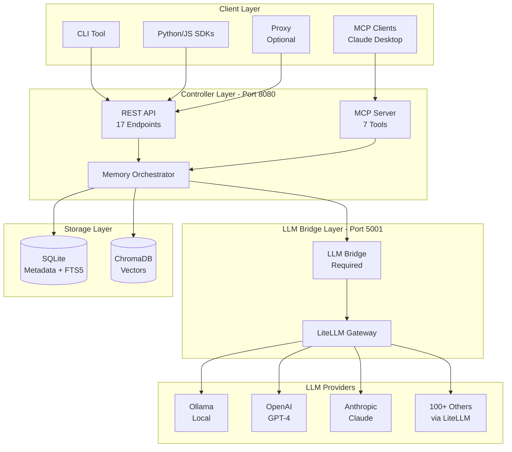
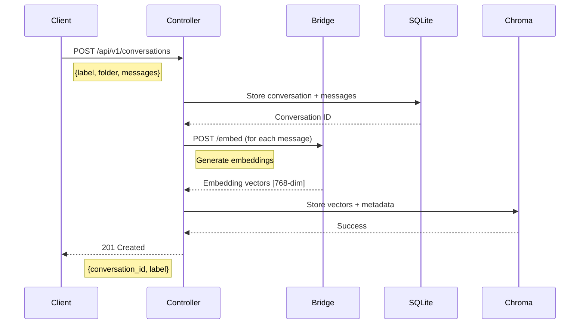
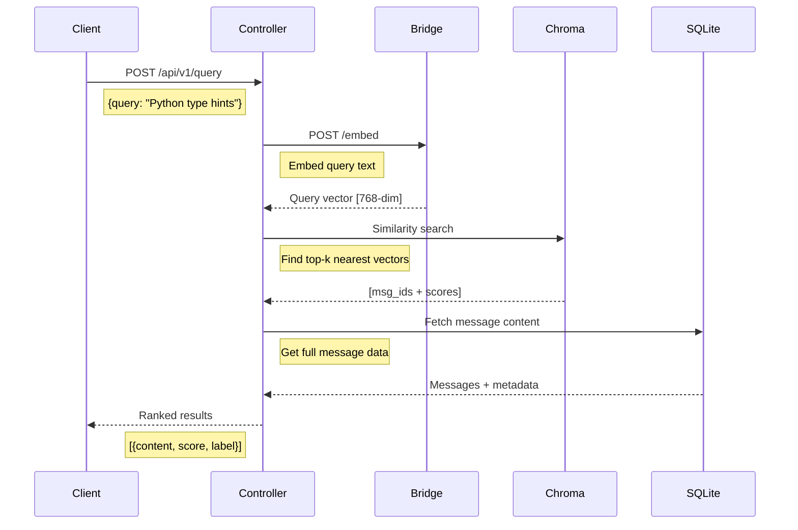
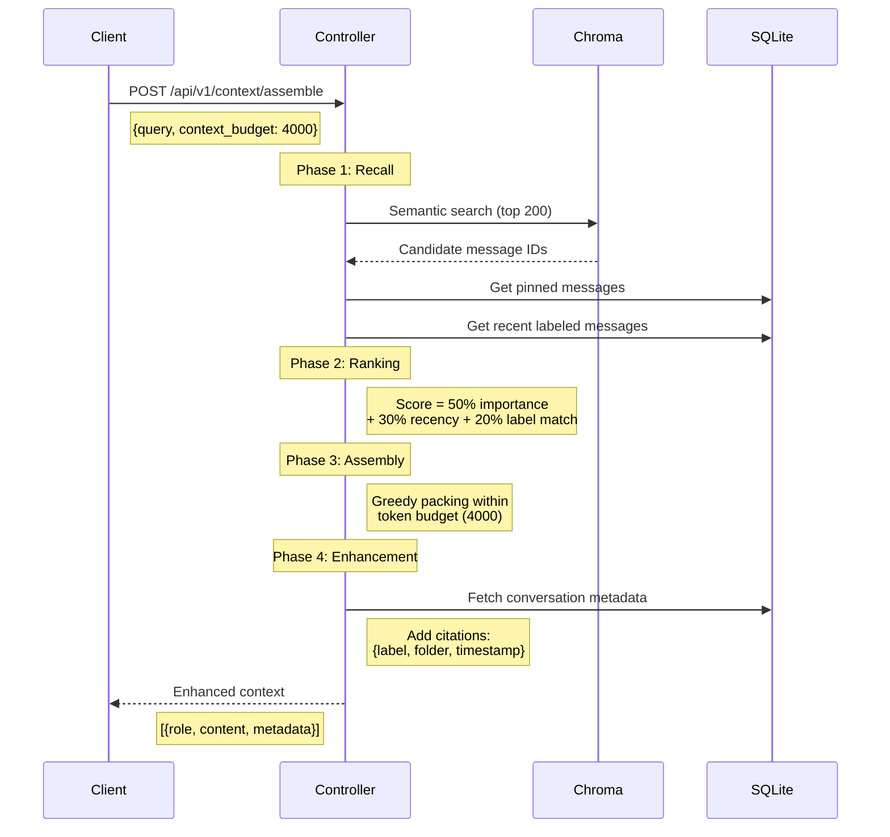
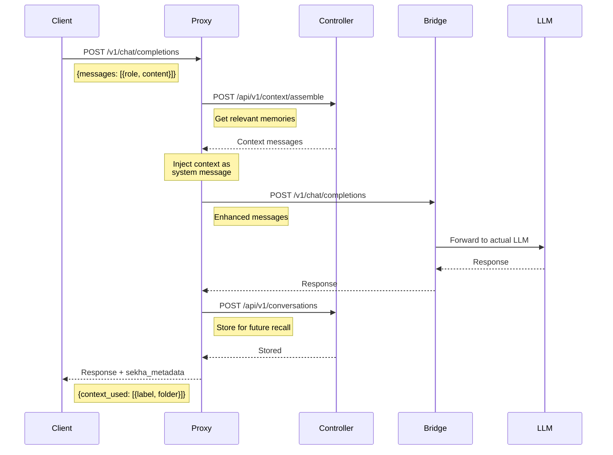

# System Architecture

A comprehensive overview of Sekha's architecture, components, and data flow.

## High-Level Architecture



## Core Components

### Controller (Rust - Port 8080)

The **memory orchestration engine** written in Rust for high performance and reliability.

**Repository**: [sekha-ai/sekha-controller](https://github.com/sekha-ai/sekha-controller)

**Responsibilities:**

- **REST API Server**: 17 endpoints for conversation management
- **MCP Protocol Server**: 7 tools for Claude Desktop and MCP-compatible clients
- **Memory Orchestration**: 4-phase context assembly algorithm
- **Storage Management**: SQLite + ChromaDB coordination
- **Pruning & Summarization**: Intelligent memory management
- **Authentication**: Bearer token auth for API and MCP access

**Key Endpoints** (17 total):

| Endpoint | Method | Purpose |
|----------|--------|----------|
| `/api/v1/conversations` | POST | Store conversation with messages |
| `/api/v1/conversations/{id}` | GET | Retrieve conversation by ID |
| `/api/v1/query` | POST | Semantic + full-text search |
| `/api/v1/context/assemble` | POST | Intelligent context assembly |
| `/api/v1/prune/by-importance` | POST | Prune low-value conversations |
| `/api/v1/prune/by-age` | POST | Archive old conversations |
| `/api/v1/summarize/daily` | POST | Generate daily summary |
| `/api/v1/summarize/weekly` | POST | Generate weekly summary |
| `/api/v1/summarize/monthly` | POST | Generate monthly summary |
| `/api/v1/labels/suggest` | POST | AI-powered label suggestions |
| `/health` | GET | Health check endpoint |

**MCP Tools** (7 total):

1. `memory_store` - Store conversations with auto-labeling
2. `memory_search` - Semantic search with filters
3. `memory_update` - Update conversation metadata
4. `memory_prune` - Get pruning suggestions
5. `memory_get_context` - Retrieve conversation context
6. `memory_export` - Export conversations (JSON/Markdown)
7. `memory_stats` - Memory usage statistics

**Technology Stack:**

- **[Axum](https://github.com/tokio-rs/axum)** - Async web framework
- **[SeaORM](https://www.sea-ql.org/SeaORM/)** - Database ORM with migrations
- **[Tokio](https://tokio.rs/)** - Async runtime
- **[Tower](https://github.com/tower-rs/tower)** - Middleware (auth, CORS, rate limiting)
- **[Serde](https://serde.rs/)** - Serialization/deserialization

**Performance Characteristics:**

- Sub-100ms query latency
- Async I/O throughout
- Memory-safe concurrency (Rust guarantees)
- Zero-copy operations where possible

### LLM Bridge (Python - Port 5001)

The **universal LLM adapter** that enables the Controller to work with any LLM provider.

**Repository**: [sekha-ai/sekha-llm-bridge](https://github.com/sekha-ai/sekha-llm-bridge)

**Status**: **REQUIRED** component (not optional)

**Responsibilities:**

- **Embedding Generation**: Convert text to vector embeddings
- **Summarization**: Generate hierarchical summaries (daily/weekly/monthly)
- **Entity Extraction**: Extract entities for auto-labeling
- **Importance Scoring**: Score conversations for pruning
- **Provider Abstraction**: Unified interface to 100+ LLM providers
- **Async Processing**: Celery task queue for expensive operations

**Endpoints:**

| Endpoint | Purpose |
|----------|----------|
| `POST /embed` | Generate embeddings for text |
| `POST /summarize` | Create conversation summaries |
| `POST /extract` | Extract entities from text |
| `POST /score` | Score conversation importance |
| `POST /v1/chat/completions` | OpenAI-compatible chat endpoint |
| `GET /health` | Health check |

**Supported LLM Providers** (via LiteLLM):

- **Ollama** - Local models (current default)
- **OpenAI** - GPT-4, GPT-3.5, text-embedding-3-small/large
- **Anthropic** - Claude 3 Opus/Sonnet/Haiku
- **Google** - Gemini Pro/Flash
- **Cohere** - Command, Embed models
- **Azure OpenAI** - Enterprise deployments
- **AWS Bedrock** - Claude via AWS
- **100+ more** - Full LiteLLM support

**Technology Stack:**

- **[FastAPI](https://fastapi.tiangolo.com/)** - HTTP API framework
- **[LiteLLM](https://litellm.ai)** - Universal LLM gateway
- **[Celery](https://docs.celeryq.dev/)** - Async task queue
- **[Redis](https://redis.io/)** - Celery broker and result backend
- **[Pydantic](https://pydantic.dev/)** - Data validation

**Why Required:**

The Controller (Rust) focuses on memory orchestration and storage. LLM Bridge handles all LLM-specific operations, providing:

1. **Language Flexibility** - Python ecosystem for ML/AI libraries
2. **Provider Abstraction** - Switch LLMs without changing Controller
3. **Async Processing** - Non-blocking expensive operations
4. **Extensibility** - Easy to add new LLM providers

### Proxy (Python - Port 8081)

The **transparent capture layer** that auto-injects context and stores conversations.

**Repository**: [sekha-ai/sekha-proxy](https://github.com/sekha-ai/sekha-proxy)

**Status**: **OPTIONAL** component

**Responsibilities:**

- **Request Interception**: Sits between client and LLM
- **Context Injection**: Automatically adds relevant past conversations
- **Conversation Storage**: Saves all interactions to Controller
- **Web UI**: Configuration dashboard and conversation viewer
- **OpenAI Compatibility**: Drop-in replacement for OpenAI API

**When to Use:**

✅ Generic LLM clients (curl, Postman, OpenAI SDK)  
✅ Zero-config conversation capture  
✅ Automatic context injection  
✅ Web UI for monitoring  

**When NOT Needed:**

❌ Claude Desktop (uses MCP tools directly)  
❌ Custom integrations (can call Controller API directly)  
❌ Programmatic control over context  

**Endpoints:**

| Endpoint | Purpose |
|----------|----------|
| `POST /v1/chat/completions` | OpenAI-compatible chat (with memory) |
| `GET /` | Web UI dashboard |
| `GET /health` | Health check |
| `GET /api/info` | Proxy configuration |

**Technology Stack:**

- **[FastAPI](https://fastapi.tiangolo.com/)** - HTTP server
- **[HTTPX](https://www.python-httpx.org/)** - Async HTTP client
- **Vanilla JS** - Web UI (no framework dependencies)

### Storage Layer

Dual storage architecture optimized for different data types.

#### SQLite - Structured Metadata

**Purpose**: Store conversation metadata, labels, folders, and structured data.

**Features:**

- **FTS5 Full-Text Search**: Fast exact phrase matching
- **ACID Transactions**: Data integrity guarantees
- **Zero Configuration**: Embedded database, no server
- **File-Based**: Easy backups and portability
- **Migration Support**: SeaORM handles schema changes

**Schema Overview:**

```sql
-- Conversations table
CREATE TABLE conversations (
    id TEXT PRIMARY KEY,
    label TEXT NOT NULL,
    folder TEXT NOT NULL DEFAULT '/',
    status TEXT NOT NULL DEFAULT 'active',
    importance_score INTEGER NOT NULL DEFAULT 5,
    word_count INTEGER NOT NULL DEFAULT 0,
    session_count INTEGER DEFAULT 1,
    created_at DATETIME NOT NULL,
    updated_at DATETIME NOT NULL
);

-- Messages table
CREATE TABLE messages (
    id TEXT PRIMARY KEY,
    conversation_id TEXT NOT NULL,
    role TEXT NOT NULL,
    content TEXT NOT NULL,
    timestamp DATETIME NOT NULL,
    embedding_id TEXT,
    metadata JSON,
    FOREIGN KEY (conversation_id) REFERENCES conversations(id)
);

-- FTS5 virtual table for full-text search
CREATE VIRTUAL TABLE messages_fts USING fts5(
    content,
    content=messages,
    content_rowid=rowid
);
```

**Why SQLite:**

- Perfect for single-server deployments
- Handles billions of rows
- Excellent for structured queries (labels, folders, dates)
- Clear migration path to PostgreSQL for multi-user

#### ChromaDB - Vector Embeddings

**Purpose**: Store message embeddings for semantic similarity search.

**Features:**

- **Vector Similarity Search**: Cosine similarity for semantic matching
- **Metadata Filtering**: Filter by conversation ID, folder, label
- **Persistent Storage**: Data survives restarts
- **Docker Ready**: Easy deployment
- **Open Source**: No vendor lock-in

**Why ChromaDB:**

- Purpose-built for embeddings
- Fast similarity calculations
- Supports 768-dim vectors (nomic-embed-text)
- Scales to millions of vectors
- REST API for language-agnostic access

**Storage Format:**

```json
{
  "ids": ["message-uuid-1"],
  "embeddings": [[0.123, -0.456, ...]],  // 768-dim vector
  "metadatas": [{
    "conversation_id": "conv-uuid",
    "message_id": "msg-uuid",
    "label": "Python Discussion",
    "folder": "/work/python",
    "timestamp": "2026-01-25T12:00:00"
  }]
}
```

## Data Flow Patterns

### 1. Store Conversation



### 2. Semantic Search



### 3. Context Assembly (4-Phase Algorithm)



### 4. Proxy Flow (Optional)



## Memory Orchestration

The intelligence layer that makes Sekha's memory system effective.

### 4-Phase Context Assembly

Implemented in `src/orchestrator/context_assembly.rs`

**Phase 1: Recall** - Gather candidates
- Semantic search (top 200 messages)
- Pinned conversations (importance >= 10)
- Recent labeled messages (last 7 days)

**Phase 2: Ranking** - Composite scoring
```rust
score = (importance * 0.5) + (recency * 0.3) + (label_match * 0.2)
```
- Importance: User-defined score (1-10)
- Recency: Exponential decay (7-day half-life)
- Label match: Boost for preferred labels

**Phase 3: Assembly** - Token budgeting
- Greedy packing algorithm
- Reserve 15% for system prompt
- Estimate 1 token ≈ 4 characters
- Stop when budget exhausted

**Phase 4: Enhancement** - Add metadata
- Fetch conversation context
- Add citations: `{label, folder, timestamp}`
- Include in message metadata field

### Hierarchical Summarization

Implemented in `src/orchestrator/summarizer.rs`

**Three Levels:**

1. **Daily Summaries** - Last 24 hours of messages
2. **Weekly Summaries** - Aggregates 7 daily summaries
3. **Monthly Summaries** - Aggregates 4 weekly summaries

**Process:**
```
Messages → Daily Summary (200 words)
  ↓
7 Daily Summaries → Weekly Summary (500 words)
  ↓
4 Weekly Summaries → Monthly Summary (1000 words)
```

**Benefits:**
- Reduces token usage for old conversations
- Maintains temporal context
- Falls back to summaries when budget tight

### Pruning Engine

Implemented in `src/orchestrator/pruning_engine.rs`

**Strategies:**

1. **By Age** - Archive conversations older than N days
2. **By Importance** - Remove conversations below threshold
3. **By Inactivity** - Archive stale conversations

**Pruning Suggestions Include:**
- Conversation ID and label
- Last accessed date
- Message count and token estimate
- Current importance score
- Recommendation: `archive`, `delete`, or `keep`

**Estimated Savings:**
Calculates total tokens that would be freed by archiving suggested conversations.

## Deployment Architecture

See [Deployment Options](../deployment/docker-compose.md) for detailed guides.

### Single Server (Current)

```
┌─────────────────────────────────────┐
│       Docker Compose Stack          │
│                                     │
│  ┌──────────┐  ┌─────────────────┐ │
│  │Controller│  │   LLM Bridge    │ │
│  │:8080     │  │   :5001         │ │
│  └──────────┘  └─────────────────┘ │
│       │               │             │
│       ├───────┬───────┤             │
│       │       │       │             │
│  ┌────▼───┐ ┌▼─────┐ ┌▼──────┐    │
│  │SQLite  │ │Chroma│ │ Redis │    │
│  │:file   │ │:8000 │ │ :6379 │    │
│  └────────┘ └──────┘ └───────┘    │
│                                     │
│  Optional:                          │
│  ┌──────────┐                       │
│  │  Proxy   │                       │
│  │  :8081   │                       │
│  └──────────┘                       │
└─────────────────────────────────────┘
         │
         ▼
    Ollama :11434
    (on host via host.docker.internal)
```

**Capacity:**
- 100,000+ conversations
- 1,000,000+ messages
- 2-4GB RAM
- Sub-100ms query times

**Target:**
- Individual users
- Small teams (<10)
- Development/testing
- Edge deployments

### Distributed (Planned Q2 2026)

For enterprise and multi-user deployments:

- **PostgreSQL** - Replace SQLite for multi-user
- **Redis Cluster** - Distributed caching
- **Load Balancer** - Horizontal Controller scaling
- **Distributed Chroma** - Replicated vector storage
- **Message Queue** - RabbitMQ/Kafka for async processing

## Technology Stack Summary

| Component | Language | Framework | Purpose |
|-----------|----------|-----------|----------|
| **Controller** | Rust | Axum + SeaORM | Memory orchestration |
| **LLM Bridge** | Python | FastAPI + LiteLLM | Universal LLM adapter |
| **Proxy** | Python | FastAPI + HTTPX | Optional capture layer |
| **SQLite** | C | SQLite 3 | Structured data |
| **ChromaDB** | Python | FastAPI | Vector embeddings |
| **Redis** | C | Redis 7 | Celery broker |

## Performance Characteristics

Based on production workloads (single server):

| Operation | Latency | Notes |
|-----------|---------|-------|
| Store Conversation | ~50ms | Includes embedding generation |
| Semantic Search | ~30ms | ChromaDB vector similarity |
| Full-Text Search | ~10ms | SQLite FTS5 index |
| Context Assembly | ~100ms | Full 4-phase retrieval |
| Daily Summary | ~2s | LLM-dependent |

**Scalability:**
- SQLite handles billions of rows
- ChromaDB scales to millions of vectors
- Search remains sub-100ms at scale

## Next Steps

- **[API Reference](../api-reference/rest-api.md)** - Complete endpoint documentation
- **[MCP Tools](../api-reference/mcp-tools.md)** - Claude Desktop integration
- **[Deployment Guide](../deployment/docker-compose.md)** - Get Sekha running
- **[Development](../development/contributing.md)** - Contribute to Sekha
