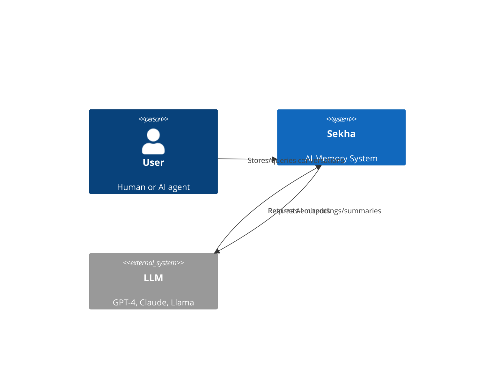
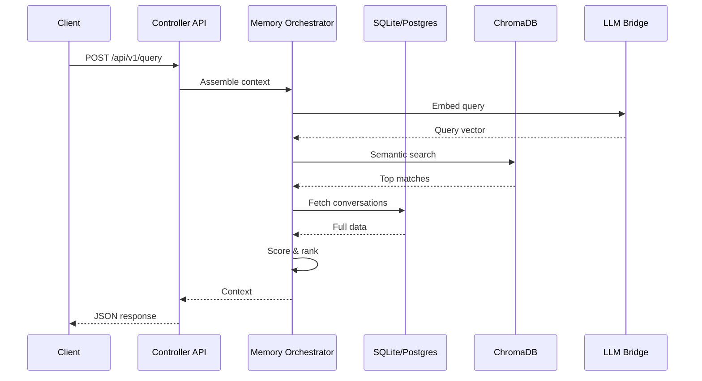

# System Overview

Sekha is a production-ready **universal memory system for AI** that provides persistent, searchable context windows.

## Architecture at a Glance



## Core Principles

### 1. Local-First

**Your data stays on your infrastructure.**

- No cloud dependencies
- Air-gapped deployment supported
- GDPR/HIPAA compliant

### 2. LLM-Agnostic

**Use any LLM without vendor lock-in.**

- Currently: Ollama (Llama, Mistral, etc.)
- Q1 2026: OpenAI, Anthropic, Google
- Switch LLMs mid-conversation

### 3. Production-Ready

**Built for real-world use.**

- 80%+ test coverage
- Sub-100ms semantic queries
- ACID guarantees
- Crash recovery

### 4. Developer-Friendly

**Multiple integration paths.**

- REST API (17 endpoints)
- MCP protocol (7 tools)
- Python/JS SDKs
- CLI tool

---

## Technology Stack

| Layer | Technology | Why |
|-------|-----------|-----|
| **Controller** | Rust 1.83+ | Performance, safety, small binaries |
| **Web Framework** | Axum | Async, fast, ergonomic |
| **ORM** | SeaORM | Type-safe SQL, migrations |
| **Database** | SQLite/Postgres | ACID, mature, embeddable |
| **Vector Store** | ChromaDB | Fast semantic search |
| **LLM Bridge** | Python + FastAPI | Ecosystem, LangChain integration |
| **Protocol** | REST + MCP | Standard, widely supported |

---

## Deployment Models

### Single Binary

**Simplest deployment - just run the binary.**

```bash
./sekha-controller --config ~/.sekha/config.toml
```

**Pros:**
- No Docker required
- Minimal dependencies
- Fast startup (~100ms)

**Cons:**
- Manual dependency management
- Single process (no LLM bridge)

### Docker Compose

**Recommended for development and small deployments.**

```bash
docker compose up -d
```

**Includes:**
- Sekha Controller
- LLM Bridge
- ChromaDB
- Ollama (optional)

**Pros:**
- One command deployment
- All dependencies included
- Easy updates

**Cons:**
- Requires Docker
- Higher resource usage

### Kubernetes

**For production multi-node deployments.**

```bash
kubectl apply -f sekha-deployment.yaml
```

**Features:**
- Auto-scaling
- Load balancing
- High availability
- Rolling updates

---

## Request Flow



---

## Next Steps

- [Architecture Index](index.md) - Full architecture overview
- [Memory Orchestration](memory-orchestration.md) - How context assembly works
- [Controller Details](controller.md) - Rust controller deep dive
- [LLM Bridge](llm-bridge.md) - Python bridge details

---

*Last updated: January 2026*
