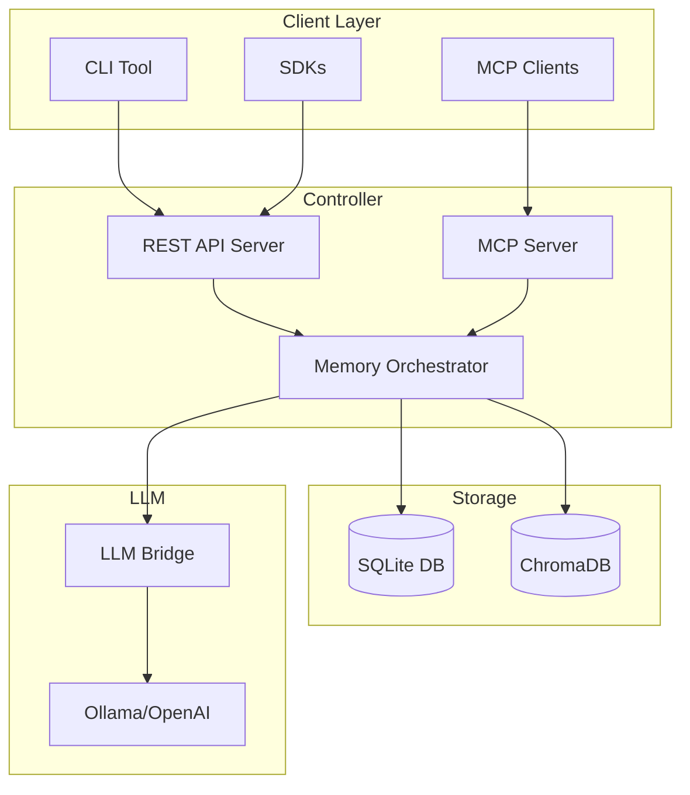
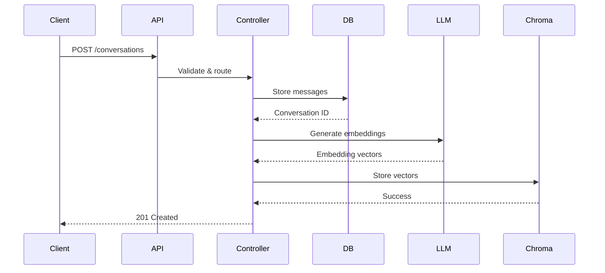
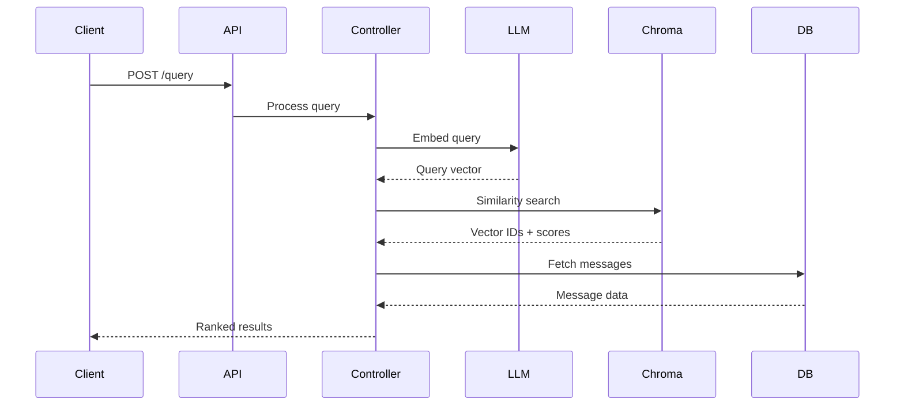
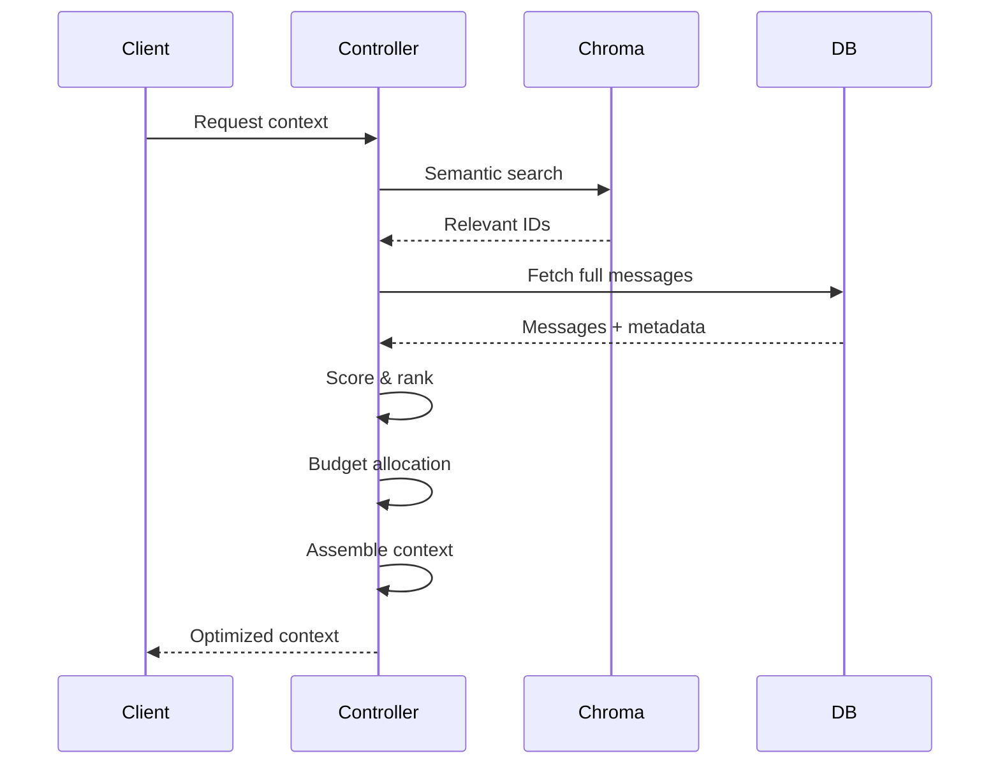

# System Overview

A deep dive into Sekha's architecture.

## System Architecture

## Core Components

### Controller (Rust)

The heart of Sekha, written in Rust for performance and reliability.

**Responsibilities:**
- REST API server (Axum framework)
- Request routing and validation
- Business logic orchestration
- Database operations (SeaORM)
- MCP protocol server
- Rate limiting and auth

**Key Features:**
- Sub-100ms query latency
- 1000+ requests/second throughput
- Memory-safe concurrency
- Zero-copy operations
- Async I/O throughout

**Technology Stack:**
- [Axum](https://github.com/tokio-rs/axum) - Web framework
- [SeaORM](https://www.sea-ql.org/SeaORM/) - Database ORM
- [Tokio](https://tokio.rs/) - Async runtime
- [Tower](https://github.com/tower-rs/tower) - Middleware

### LLM Bridge (Python)

Handles all LLM-related operations in a separate service.

**Responsibilities:**
- Embedding generation
- Conversation summarization
- Label suggestions
- Provider abstraction
- Async job queue

**Supported Providers:**
- **Ollama** - Local models (default)
- **OpenAI** - GPT-4, text-embedding-ada-002 (coming soon)
- **Anthropic** - Claude models (coming soon)
- **Google** - Gemini (planned)

**Technology Stack:**
- FastAPI - HTTP server
- LangChain - LLM orchestration
- Pydantic - Data validation
- AsyncIO - Concurrent processing

### Storage Layer

Dual storage approach for optimal performance.

**SQLite - Structured Data:**
- Conversations and metadata
- User preferences
- Labels and folders
- System configuration
- Transaction support

**Why SQLite:**
- Zero-config embedded database
- ACID transactions
- Excellent single-server performance
- File-based (easy backups)
- PostgreSQL migration path

**ChromaDB - Vector Embeddings:**
- Message embeddings (768-dim)
- Semantic search index
- Similarity calculations
- Metadata filtering

**Why ChromaDB:**
- Built for embeddings
- Fast cosine similarity
- Metadata support
- Docker-ready
- Open source

## Data Flow

### 1. Store Conversation

### 2. Semantic Query

### 3. Context Assembly

## Memory Orchestration

The intelligence behind Sekha's memory system.

[**Memory Orchestration Details →**](memory-orchestration.md)

**Key Algorithms:**

1. **Relevance Scoring**
   - Semantic similarity (embedding distance)
   - Recency decay (time-based weighting)
   - Importance boost (user-defined scores)
   - Folder filtering (context isolation)

2. **Context Budgeting**
   - Token counting (accurate estimation)
   - Priority queue (importance-ordered)
   - Greedy packing (maximize utility)
   - Summary fallback (compression)

3. **Deduplication**
   - Content hashing (exact duplicates)
   - Fuzzy matching (similar messages)
   - Temporal clustering (conversation flow)

## Scaling Architecture

### Current (Single Server)

Optimized for:
- Individual users
- Small teams (<10 people)
- Development environments
- Edge deployments

**Capacity:**
- 100,000+ conversations
- 1,000,000+ messages
- 100 queries/second
- 2-4GB RAM

### Future (Distributed)

Planned for Q2-Q3 2026:

- PostgreSQL for multi-user
- Redis for caching
- Load balancer for horizontal scaling
- Distributed ChromaDB
- Message queue (RabbitMQ/Kafka)

## Next Steps

- [Memory Orchestration](memory-orchestration.md) - Detailed algorithms
- [Deployment](../deployment/docker-compose.md) - Deploy the stack
- [API Reference](../api-reference/rest-api.md) - Use the API
