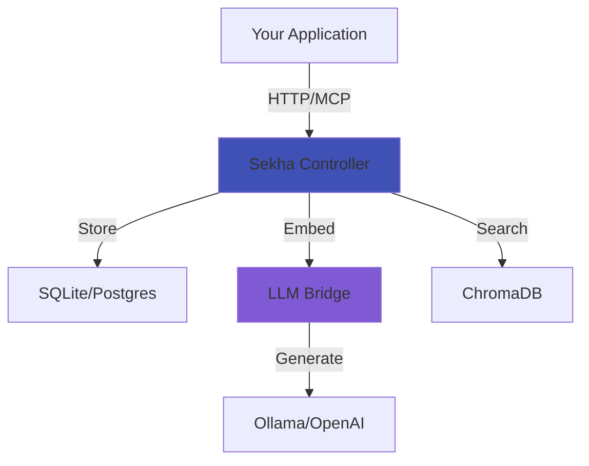

# Getting Started with Sekha

Welcome to Sekha! This guide will help you go from zero to storing your first AI conversation in under 10 minutes.

## What You'll Learn

- [Quickstart](quickstart.md) - 5-minute setup with Docker Compose
- [Installation](installation.md) - All installation methods (Docker, binary, source)
- [Configuration](configuration.md) - Customize Sekha for your needs
- [First Conversation](first-conversation.md) - Store and retrieve your first memory

## Prerequisites

Before starting, ensure you have:

**For Docker installation (recommended):**
- Docker Desktop or Docker Engine 24.0+
- Docker Compose 2.0+
- 4GB free disk space
- 2GB available RAM

**For local binary:**
- Ollama (for embeddings) or OpenAI API key
- 2GB free disk space
- 1GB available RAM

## Choose Your Path

=== "Quickest: Docker"

    **Best for:** First-time users, testing, teams
    
    ```bash
    git clone https://github.com/sekha-ai/sekha-docker.git
    cd sekha-docker
    docker compose up -d
    ```
    
    [:octicons-arrow-right-24: Full Quickstart Guide](quickstart.md)

=== "Flexible: Local Binary"

    **Best for:** Developers, custom setups
    
    ```bash
    cargo install --git https://github.com/sekha-ai/sekha-controller
    sekha-controller setup
    sekha-controller start
    ```
    
    [:octicons-arrow-right-24: Installation Guide](installation.md)

=== "Production: Kubernetes"

    **Best for:** Enterprises, scale, HA
    
    ```bash
    helm install sekha sekha/sekha-controller
    ```
    
    [:octicons-arrow-right-24: Deployment Guide](../deployment/kubernetes.md)

## What Gets Installed

A complete Sekha deployment includes:

**Core Services:**
- **Sekha Controller** (Rust) - Memory engine and API server
- **LLM Bridge** (Python) - Embeddings and summarization
- **ChromaDB** - Vector database for semantic search
- **SQLite or PostgreSQL** - Structured data storage

**Optional Services:**
- **Ollama** - Local LLM runtime (free, private)
- **Redis** - Caching and task queue (for scale)

## System Architecture



## Next Steps

Depending on your goal:

**Just exploring?**  
→ Start with the [Quickstart](quickstart.md) (5 minutes)

**Ready to deploy?**  
→ See [Installation Options](installation.md)

**Need to customize?**  
→ Review [Configuration](configuration.md)

**Want to integrate?**  
→ Check [API Reference](../api-reference/rest-api.md)

---

!!! question "Need Help?"

    - [:material-github: GitHub Issues](https://github.com/sekha-ai/sekha-controller/issues)
    - [:simple-discord: Discord Community](https://discord.gg/sekha)
    - [:material-email: Email Support](mailto:hello@sekha.dev)

---

[:octicons-arrow-right-24: Start Quickstart](quickstart.md){ .md-button .md-button--primary }