# Sekha: Universal AI Memory Controller

> **The Memory System That Never Forgets - Build AI That Remembers Everything**

<div class="grid cards" markdown>

-   :material-infinity:{ .lg .middle } __Infinite Context Windows__

    ---

    Never hit token limits again. Conversations span days, weeks, months, or **years** with perfect continuity.

    [:octicons-arrow-right-24: Get Started](getting-started/quickstart.md)

-   :material-brain:{ .lg .middle } __Intelligent Memory__

    ---

    Semantic search, hierarchical summaries, and smart context assembly. Your AI remembers what matters.

    [:octicons-arrow-right-24: Learn More](architecture/overview.md)

-   :material-lock:{ .lg .middle } __Sovereign & Private__

    ---

    Self-hosted, local-first architecture. Your conversations are **your** intellectual property.

    [:octicons-arrow-right-24: Deploy Now](deployment/docker-compose.md)

-   :material-api:{ .lg .middle } __Universal Integration__

    ---

    REST API, MCP protocol, Python/JS SDKs. Works with any LLM - OpenAI, Anthropic, Ollama, 100+ more via LiteLLM.

    [:octicons-arrow-right-24: API Reference](api-reference/rest-api.md)

</div>

---

## The Problem Sekha Solves

Every AI conversation today faces critical failures:

<div class="annotate" markdown>

1. **🔥 Broken Context** - Your LLM runs out of memory mid-conversation (1)
2. **🧠 Forgotten Context** - Long conversations forget everything from earlier sessions (2)
3. **⏱️ Agent Breakdowns** - AI agents fail on multi-step tasks spanning hours or days (3)
4. **🚫 No Continuity** - Each new chat starts from zero, wasting time re-explaining (4)
5. **📊 Lost Knowledge** - Years of valuable interactions vanish at token limits (5)

</div>

1. Most LLMs have 8k-128k token limits. One conversation can hit that.
2. ChatGPT, Claude, and others lose context after 30 days or fewer messages.
3. Agents need persistent memory to track multi-day workflows and learn from mistakes.
4. You re-explain your project, codebase, and preferences in every new session.
5. Your intellectual capital - research notes, decisions, insights - disappears.

---

## The Solution

**Sekha gives AI persistent, searchable, infinite memory** - like a second brain that never forgets.

```mermaid
graph LR
    A[User/Agent] -->|Conversations| B[Sekha Controller]
    B -->|Stores| C[SQLite + Chroma]
    B -->|Via LLM Bridge| D[LiteLLM]
    D -->|Any LLM| E[OpenAI/Ollama/Claude/100+]
    C -->|Retrieves| B
    B -->|Context| A
    
    style B fill:#4051b5
    style C fill:#2d3748
    style D fill:#805ad5
```



Sekha sits **between** you and any LLM, capturing every interaction and intelligently retrieving relevant context when needed.

### Key Features

**♾️ Infinite Context** - Conversations spanning millions of messages  
**🔍 Semantic Search** - Find conversations by meaning, not just keywords  
**🧠 Smart Assembly** - Auto-build perfect context from past interactions  
**📊 Hierarchical Summaries** - Daily → Weekly → Monthly rollups  
**🏷️ Organization** - Labels, folders, importance scoring  
**🔒 Sovereign** - Self-hosted, local-first, your data never leaves  
**🔌 LLM Agnostic** - Works with 100+ LLMs via LiteLLM  
**⚡ Production Ready** - 80%+ test coverage, Docker deployment, sub-100ms queries  

---

## Use Cases

=== "Professionals"

    **Career-spanning AI assistant**
    
    - Track projects across months/years
    - Remember every decision and rationale
    - Build expertise over time
    - Never re-explain context

=== "Developers"

    **Code assistant that evolves**
    
    - Remembers entire codebase evolution
    - Tracks architectural decisions
    - Learns team conventions
    - Assists with debugging across sessions

=== "Researchers"

    **Persistent research companion**
    
    - Maintains context across studies
    - Connects insights from papers
    - Tracks methodology evolution
    - Builds knowledge graph over time

=== "AI Agents"

    **Self-improving autonomous agents**
    
    - Learn from every interaction
    - Never repeat mistakes
    - Track multi-day workflows
    - Share knowledge between agent instances

---

## Quick Start

!!! tip "Recommended: Docker Compose"

    ```bash
    # Clone deployment repo
    git clone https://github.com/sekha-ai/sekha-docker.git
    cd sekha-docker/docker
    
    # Start full stack
    docker compose -f docker-compose.yml -f docker-compose.full.yml up -d
    
    # Verify health
    curl http://localhost:8080/health
    ```
    
    **What gets deployed:**
    
    - ✅ **Sekha Controller** (Rust) - Memory orchestration engine
    - ✅ **LLM Bridge** (Python) - Required LLM adapter via LiteLLM
    - ✅ **ChromaDB** - Vector embeddings storage
    - ✅ **Redis** - Celery broker for async tasks
    - 🔧 **Ollama** (optional) - Local LLM, or use OpenAI/Anthropic/others
    - 🔧 **Proxy** (optional) - Transparent capture layer

[:octicons-arrow-right-24: Full Installation Guide](getting-started/installation.md){ .md-button .md-button--primary }
[:material-package: Python Packages](getting-started/python-installation.md){ .md-button }

---

## Architecture

Sekha is built for **production use** with world-class engineering:

```
┌───────────────────────────────────────────────────────────┐
│  SEKHA CONTROLLER (Rust) - Memory Orchestration Engine    │
│  • REST API (19 endpoints)                                │
│  • MCP Server (7 tools for Claude Desktop)                │
│  • 4-Phase Context Assembly                               │
│  • SQLite (metadata) + ChromaDB (vectors)                 │
└────────────────────┬──────────────────────────────────────┘
                     │
                     ▼
┌───────────────────────────────────────────────────────────┐
│  LLM BRIDGE (Python) - REQUIRED                           │
│  • Embedding generation (nomic-embed-text)                │
│  • Summarization & entity extraction                      │
│  • LiteLLM gateway (100+ LLM providers)                   │
│  • Celery async task queue                                │
└────────────────────┬──────────────────────────────────────┘
                     │
          ┌──────────┼──────────┐
          ▼          ▼          ▼
     ┌────────┐ ┌──────────┐ ┌──────────┐
     │ Ollama │ │  OpenAI  │ │ Claude   │
     │ Local  │ │   GPT-4  │ │  Sonnet  │
     └────────┘ └──────────┘ └──────────┘
                 + 97 more LLM providers

┌───────────────────────────────────────────────────────────┐
│  PROXY (Python) - OPTIONAL                                │
│  • Transparent capture for generic LLM clients            │
│  • Auto-injects context from past conversations           │
│  • OpenAI-compatible API endpoint                         │
│  • Web UI dashboard                                       │
└───────────────────────────────────────────────────────────┘
```

**Required Components:**

1. **Sekha Controller** (Rust) - Core memory engine
2. **LLM Bridge** (Python) - Universal LLM adapter
3. **ChromaDB** - Vector similarity search
4. **Redis** - Async task queue broker

**Optional Components:**

- **Proxy** - For transparent capture
- **Ollama** - For local LLMs (or use cloud providers)

[:octicons-arrow-right-24: Architecture Deep Dive](architecture/overview.md)

---

## Open Source & Sovereign

**Dual License Model:**

- **AGPL-3.0** - Free forever for individuals, non-profits, academics, small businesses (<50 employees)
- **Commercial License** - Usage-based pricing for enterprises (contact for details)

**Your data, your control:**

✅ Self-hosted on your infrastructure  
✅ No telemetry or phone-home  
✅ Air-gapped deployment ready  
✅ GDPR/HIPAA-compliant architecture  
✅ Full data portability (export to JSON/Markdown)  

[:octicons-arrow-right-24: License Details](about/license.md)

---

## Multi-Repository Ecosystem

Sekha is built as a modular system:

| Repository | Purpose | Language | Status | Install |
|------------|---------|----------|--------|---------|
| [sekha-controller](https://github.com/sekha-ai/sekha-controller) | Memory orchestration engine | Rust | ✅ Production | Docker/Source |
| [sekha-llm-bridge](https://github.com/sekha-ai/sekha-llm-bridge) | LLM adapter (REQUIRED) | Python | ✅ Production | PyPI/Docker |
| [sekha-proxy](https://github.com/sekha-ai/sekha-proxy) | Transparent capture (OPTIONAL) | Python | ✅ Production | Docker/Source |
| [sekha-docker](https://github.com/sekha-ai/sekha-docker) | Deployment configurations | Docker | ✅ Production | Docker |
| [sekha-mcp](https://github.com/sekha-ai/sekha-mcp) | MCP protocol server | Python | ✅ Production | PyPI/Docker |
| [sekha-python-sdk](https://github.com/sekha-ai/sekha-python-sdk) | Python client library | Python | 🔜 Publishing | PyPI |
| [sekha-js-sdk](https://github.com/sekha-ai/sekha-js-sdk) | JavaScript/TypeScript SDK | TypeScript | 🔜 Publishing | npm |
| [sekha-vscode](https://github.com/sekha-ai/sekha-vscode) | VS Code extension | TypeScript | 🚧 Beta | Marketplace |
| [sekha-cli](https://github.com/sekha-ai/sekha-cli) | Command-line interface | Go | 🚧 Beta | Binary |
| [sekha-obsidian](https://github.com/sekha-ai/sekha-obsidian) | Obsidian note integration | TypeScript | 🚧 Beta | Plugin |

**Now Available on PyPI:**

- `pip install sekha-llm-bridge` - Universal LLM adapter
- `pip install sekha-mcp` - MCP protocol server for Claude Desktop

[:octicons-arrow-right-24: Python Installation Guide](getting-started/python-installation.md)

---

## Community & Support

<div class="grid cards" markdown>

-   :material-github:{ .lg .middle } __GitHub__

    ---

    [:octicons-mark-github-16: sekha-ai](https://github.com/sekha-ai)

-   :material-chat:{ .lg .middle } __Discord__

    ---

    [:simple-discord: Join Community](https://discord.gg/gZb7U9deKH)

-   :material-email:{ .lg .middle } __Email__

    ---

    [:material-email: hello@sekha.dev](mailto:hello@sekha.dev)

-   :material-book-open:{ .lg .middle } __Discussions__

    ---

    [:octicons-comment-discussion-16: GitHub Discussions](https://github.com/sekha-ai/sekha-controller/discussions)

</div>

---

## Next Steps

<div class="grid cards" markdown>

-   [:material-rocket-launch: **Quickstart**](getting-started/quickstart.md)
    
    Get up and running in 5 minutes

-   [:material-docker: **Deploy**](deployment/docker-compose.md)
    
    Production Docker deployment

-   [:material-api: **API Reference**](api-reference/rest-api.md)
    
    19 REST endpoints + 7 MCP tools

-   [:material-puzzle: **Integrations**](integrations/claude-desktop.md)
    
    Connect with Claude, VS Code, more

</div>

---

<div align="center" markdown>

**Built for important things that actually need to be completed.**  
**For problems that actually need to be solved.**

*Sekha Project • [GitHub](https://github.com/sekha-ai) • January 2026*

</div>
