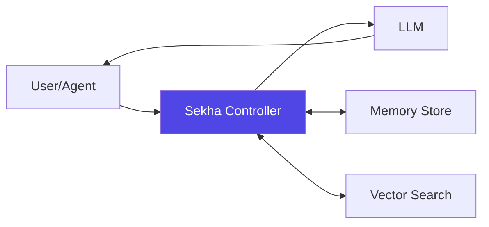

# Welcome to Sekha Documentation

-   :material-clock-fast:{ .lg .middle } __Quick Start__

    ---

    Get Sekha running in 5 minutes with Docker Compose

    [:octicons-arrow-right-24: Quickstart Guide](getting-started/quickstart.md)

-   :material-api:{ .lg .middle } __API Reference__

    ---

    Complete REST API and MCP protocol documentation

    [:octicons-arrow-right-24: API Docs](api-reference/rest-api.md)

-   :material-cloud-upload:{ .lg .middle } __Deployment__

    ---

    Deploy on Docker, Kubernetes, AWS, Azure, or GCP

    [:octicons-arrow-right-24: Deployment Guide](deployment/index.md)

-   :material-code-braces:{ .lg .middle } __SDKs & Integrations__

    ---

    Python, JavaScript, VS Code, Claude Desktop, and more

    [:octicons-arrow-right-24: Browse Integrations](integrations/index.md)

## What is Sekha?

**Sekha Controller is a production-ready AI memory system that solves the fundamental limitations of conversational AI.**

Every AI conversation today faces critical failures:

- 🔥 **Broken Context** - Your LLM runs out of memory mid-conversation
- 🧠 **Forgotten Context** - Long-running conversations forget earlier details
- ⏱️ **Agent Breakdowns** - AI agents fail on multi-step tasks spanning hours
- 🚫 **No Continuity** - Each new chat starts from zero
- 📊 **Lost Knowledge** - Years of interactions vanish at token limits

### The Solution

Sekha gives AI **persistent, searchable, infinite memory** - like a second brain that never forgets.

## Key Features

### 🔒 Sovereign Memory
Your conversations are **your intellectual property**. Self-hosted, local-first architecture.

### ♾️ Infinite Context Windows
Conversations spanning days, weeks, months, or **years** with perfect recall.

### 🧠 Intelligent Context Assembly
Automatic retrieval, prioritization, and hierarchical summarization.

### 🔌 LLM Agnostic
Works with Ollama, OpenAI, Anthropic, Google - any LLM.

### 🚀 Production Ready
85%+ test coverage, Docker deployment, sub-100ms queries.

## Popular Use Cases

=== "For Developers"

    **Career-spanning code assistant**
    
    - Remembers every project decision
    - Tracks codebase evolution
    - Never repeats solved problems
    - Maintains context across repos

=== "For AI Agents"

    **Self-improving autonomous agents**
    
    - Learn from every interaction
    - Build long-term strategies
    - Complete multi-day tasks
    - Share knowledge between agents

=== "For Researchers"

    **Persistent research assistant**
    
    - Track experiments across studies
    - Remember methodology details
    - Connect related research
    - Never lose literature notes

=== "For Professionals"

    **Personal AI that knows your career**
    
    - Remembers client preferences
    - Tracks project histories
    - Maintains institutional knowledge
    - Provides context-aware advice

## Quick Navigation

### New Users

1. [Installation Guide](getting-started/installation.md) - Set up Sekha
2. [First Conversation](getting-started/first-conversation.md) - Store and retrieve your first memory
3. [Configuration](getting-started/configuration.md) - Customize for your needs

### Developers

1. [Architecture Overview](architecture/overview.md) - Understand the system
2. [REST API Reference](api-reference/rest-api.md) - Integrate via HTTP
3. [Python SDK](sdks/python-sdk.md) or [JavaScript SDK](sdks/javascript-sdk.md) - Use client libraries

### DevOps

1. [Docker Compose](deployment/docker-compose.md) - Quick deployment
2. [Kubernetes](deployment/kubernetes.md) - Production scale
3. [Cloud Providers](deployment/aws.md) - AWS, Azure, GCP guides

## Community & Support

- :fontawesome-brands-github: **GitHub** - [Report issues & contribute](https://github.com/sekha-ai)
- :fontawesome-brands-discord: **Discord** - [Join the community](https://discord.gg/sekha)
- :fontawesome-solid-envelope: **Email** - [hello@sekha.dev](mailto:hello@sekha.dev)

## License

Sekha is dual-licensed:

- **Open Source**: AGPL-3.0 for personal, educational, and non-commercial use
- **Commercial**: Contact [hello@sekha.dev](mailto:hello@sekha.dev) for enterprise licensing

---

**Ready to give your AI infinite memory?** Start with the [Quickstart Guide →](getting-started/quickstart.md)