# Sekha: Universal AI Memory Controller

> **The Memory System That Never Forgets - Build AI That Remembers Everything**

<div class="grid cards" markdown>

-   :material-infinity:{ .lg .middle } __Infinite Context Windows__

    ---

    Never hit token limits again. Conversations span days, weeks, months, or **years** with perfect continuity.

    [:octicons-arrow-right-24: Get Started](getting-started/quickstart.md)

-   :material-brain:{ .lg .middle } __Intelligent Memory__

    ---

    Semantic search, hierarchical summaries, and smart context assembly. Your AI remembers what matters.

    [:octicons-arrow-right-24: Learn More](architecture/overview.md)

-   :material-lock:{ .lg .middle } __Sovereign & Private__

    ---

    Self-hosted, local-first architecture. Your conversations are **your** intellectual property.

    [:octicons-arrow-right-24: Deploy Now](deployment/docker-compose.md)

-   :material-api:{ .lg .middle } __Universal Integration__

    ---

    REST API, MCP protocol, Python/JS SDKs. Works with any LLM - OpenAI, Anthropic, Ollama, custom models.

    [:octicons-arrow-right-24: API Reference](api-reference/rest-api.md)

</div>

---

## The Problem Sekha Solves

Every AI conversation today faces critical failures:

<div class="annotate" markdown>

1. **🔥 Broken Context** - Your LLM runs out of memory mid-conversation (1)
2. **🧠 Forgotten Context** - Long conversations forget everything from earlier sessions (2)
3. **⏱️ Agent Breakdowns** - AI agents fail on multi-step tasks spanning hours or days (3)
4. **🚫 No Continuity** - Each new chat starts from zero, wasting time re-explaining (4)
5. **📊 Lost Knowledge** - Years of valuable interactions vanish at token limits (5)

</div>

1. Most LLMs have 8k-128k token limits. One conversation can hit that.
2. ChatGPT, Claude, and others lose context after 30 days or fewer messages.
3. Agents need persistent memory to track multi-day workflows and learn from mistakes.
4. You re-explain your project, codebase, and preferences in every new session.
5. Your intellectual capital - research notes, decisions, insights - disappears.

---

## The Solution

**Sekha gives AI persistent, searchable, infinite memory** - like a second brain that never forgets.

```mermaid
graph LR
    A[User/Agent] -->|Conversations| B[Sekha Controller]
    B -->|Stores| C[SQLite + Chroma]
    B -->|Retrieves| D[Semantic Search]
    D -->|Context| E[LLM]
    E -->|Response| A
    
    style B fill:#4051b5
    style C fill:#2d3748
    style E fill:#805ad5
```



Sekha sits **between** you and any LLM, capturing every interaction and intelligently retrieving relevant context when needed.

### Key Features

**♾️ Infinite Context** - Conversations spanning millions of messages  
**🔍 Semantic Search** - Find conversations by meaning, not just keywords  
**🧠 Smart Assembly** - Auto-build perfect context from past interactions  
**📊 Hierarchical Summaries** - Daily → Weekly → Monthly rollups  
**🏷️ Organization** - Labels, folders, importance scoring  
**🔒 Sovereign** - Self-hosted, local-first, your data never leaves  
**🔌 LLM Agnostic** - Works with Ollama, OpenAI, Anthropic, custom models  
**⚡ Production Ready** - 85%+ test coverage, Docker deployment, sub-100ms queries  

---

## Use Cases

=== "Professionals"

    **Career-spanning AI assistant**
    
    - Track projects across months/years
    - Remember every decision and rationale
    - Build expertise over time
    - Never re-explain context

=== "Developers"

    **Code assistant that evolves**
    
    - Remembers entire codebase evolution
    - Tracks architectural decisions
    - Learns team conventions
    - Assists with debugging across sessions

=== "Researchers"

    **Persistent research companion**
    
    - Maintains context across studies
    - Connects insights from papers
    - Tracks methodology evolution
    - Builds knowledge graph over time

=== "AI Agents"

    **Self-improving autonomous agents**
    
    - Learn from every interaction
    - Never repeat mistakes
    - Track multi-day workflows
    - Share knowledge between agent instances

---

## Quick Start

!!! tip "Recommended: Docker Compose"

    ```bash
    # Clone deployment repo
    git clone https://github.com/sekha-ai/sekha-docker.git
    cd sekha-docker
    
    # Start all services
    docker compose up -d
    
    # Verify health
    curl http://localhost:8080/health
    ```
    
    **What gets deployed:**
    - Sekha Controller (Rust core)
    - LLM Bridge (Python)
    - ChromaDB (vectors)
    - Ollama (local LLM)

[:octicons-arrow-right-24: Full Installation Guide](getting-started/installation.md){ .md-button .md-button--primary }

---

## Architecture

Sekha is built for **production use** with world-class engineering:

```
┌─────────────────────────────────────────────────────────┐
│         SEKHA CONTROLLER (Rust)                          │
│         Single Binary • Portable • ~50MB                 │
└──────────────┬──────────────────────────────────────────┘
               │
    ┌──────────┼──────────┐
    ▼          ▼          ▼
┌────────┐ ┌────────┐ ┌──────────┐
│  REST  │ │  MCP   │ │ Internal │
│  API   │ │ Server │ │ Services │
└────┬───┘ └───┬────┘ └────┬─────┘
     └─────────┼───────────┘
               ▼
┌─────────────────────────────────────────────────────────┐
│        MEMORY ORCHESTRATION ENGINE                       │
│  • Semantic + Recency + Importance Ranking              │
│  • Hierarchical Summarization                            │
│  • Intelligent Pruning                                   │
│  • Label Suggestions                                     │
└──────────────┬──────────────────────────────────────────┘
               │
    ┌──────────┼──────────┐
    ▼          ▼          ▼
┌─────────┐ ┌────────┐ ┌────────────┐
│ SQLite  │ │ Chroma │ │ LLM Bridge │
│ (SeaORM)│ │ Vectors│ │  (Python)  │
└─────────┘ └────────┘ └────────────┘
```

[:octicons-arrow-right-24: Architecture Deep Dive](architecture/overview.md)

---

## Open Source & Sovereign

**Dual License Model:**

- **AGPL-3.0** - Free forever for individuals, non-profits, academics, small businesses (<50 employees)
- **Commercial License** - Usage-based pricing for enterprises (contact for details)

**Your data, your control:**

✅ Self-hosted on your infrastructure  
✅ No telemetry or phone-home  
✅ Air-gapped deployment ready  
✅ GDPR/HIPAA-compliant architecture  
✅ Full data portability (export to JSON/Markdown)  

[:octicons-arrow-right-24: License Details](about/license.md)

---

## Multi-Repository Ecosystem

Sekha is built as a modular system:

| Repository | Purpose | Status |
|------------|---------|--------|
| [sekha-controller](https://github.com/sekha-ai/sekha-controller) | Core memory engine (Rust) | ✅ Production |
| [sekha-llm-bridge](https://github.com/sekha-ai/sekha-llm-bridge) | LLM operations (Python) | ✅ Production |
| [sekha-docker](https://github.com/sekha-ai/sekha-docker) | Deployment configs | ✅ Production |
| [sekha-mcp](https://github.com/sekha-ai/sekha-mcp) | MCP protocol server | ✅ Production |
| [sekha-python-sdk](https://github.com/sekha-ai/sekha-python-sdk) | Python client | 🔜 Publishing |
| [sekha-js-sdk](https://github.com/sekha-ai/sekha-js-sdk) | JavaScript/TypeScript SDK | 🔜 Publishing |
| [sekha-vscode](https://github.com/sekha-ai/sekha-vscode) | VS Code extension | 🚧 Beta |
| [sekha-cli](https://github.com/sekha-ai/sekha-cli) | Terminal tool | 🚧 Beta |
| [sekha-obsidian](https://github.com/sekha-ai/sekha-obsidian) | Obsidian plugin | 🚧 Beta |

---

## Community & Support

<div class="grid cards" markdown>

-   :material-github:{ .lg .middle } __GitHub__

    ---

    [:octicons-mark-github-16: sekha-ai](https://github.com/sekha-ai)

-   :material-chat:{ .lg .middle } __Discord__

    ---

    [:simple-discord: Join Community](https://discord.gg/sekha)

-   :material-email:{ .lg .middle } __Email__

    ---

    [:material-email: hello@sekha.dev](mailto:hello@sekha.dev)

-   :material-book-open:{ .lg .middle } __Discussions__

    ---

    [:octicons-comment-discussion-16: GitHub Discussions](https://github.com/sekha-ai/sekha-controller/discussions)

</div>

---

## Next Steps

<div class="grid cards" markdown>

-   [:material-rocket-launch: **Quickstart**](getting-started/quickstart.md)
    
    Get up and running in 5 minutes

-   [:material-docker: **Deploy**](deployment/docker-compose.md)
    
    Production Docker deployment

-   [:material-api: **API Reference**](api-reference/rest-api.md)
    
    Complete API documentation

-   [:material-puzzle: **Integrations**](integrations/claude-desktop.md)
    
    Connect with Claude, VS Code, more

</div>

---

<div align="center" markdown>

**Built for important things that actually need to be completed.**  
**For problems that actually need to be solved.**

*Sekha Project • [GitHub](https://github.com/sekha-ai) • January 2026*

</div>